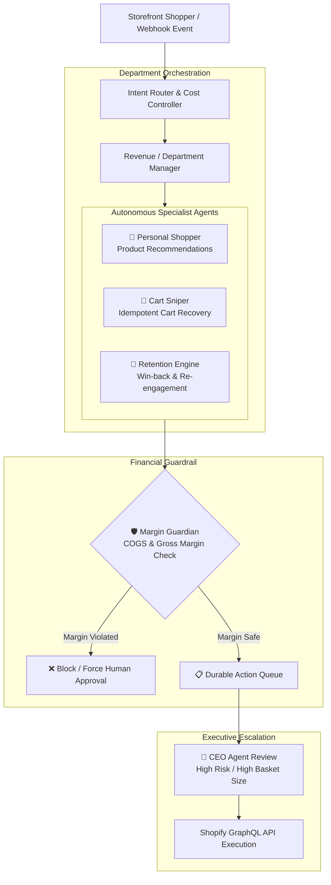

# 🛍️ ANOTAI: Shopify Autonomous Multi-Agent Revenue Team

> **Shopify embedded Remix application providing e-commerce brands with an autonomous 5-agent AI revenue and operations team with hard COGS margin protections.**

[](https://shopify.dev)
[](https://polaris.shopify.com)
[](https://remix.run)
[](https://prisma.io)
[](https://supabase.com)
[](https://deepmind.google/technologies/gemini/)

---

## 🌟 What It Does

ANOTAI gives Shopify merchants a 5-agent autonomous operations squad directly inside the Shopify Admin. It autonomously converts abandoned carts, recommends personalized products, and handles customer inquiries — while enforcing deterministic financial guardrails (**Margin Guardian**) that evaluate Cost of Goods Sold (COGS) to prevent AI agents from issuing unprofitable discounts.

---

## 🤖 The 5-Agent Squad & Hierarchy



---

## 🔒 Financial Safety & Margin Guardian

Unlike unbounded LLM chat agents that can be tricked into granting massive discounts, ANOTAI enforces a hard financial gate:

- **COGS Margin Rule:** Evaluates product variant costs from Shopify and computes real-time gross margins.
- **Veto Power:** If an AI agent attempts to offer a 20% discount on an item with a 15% margin, Margin Guardian immediately intercepts the payload, flags it with a risk score of 100, and transitions the action to manual merchant approval.
- **Token & Cost Tracking:** Records exact input tokens, output tokens, and actual dollar costs per workflow execution in Supabase audit logs (`trackAiUsage`).

---

## 📂 Repository Structure

```
ANOTAI.PRO/
├── app/
│   ├── routes/                  # Shopify embedded Remix route handlers & Polaris pages
│   ├── services/
│   │   ├── orchestrator.server.ts # Hierarchical multi-agent workflow manager
│   │   ├── agentRegistry.server.ts# Agent metadata & permission levels
│   │   ├── actionQueue.server.ts  # Durable asynchronous action executor
│   │   ├── usageTracker.server.ts # Gemini token & dollar cost accounting
│   │   └── shopify-discounts.server.ts # Shopify GraphQL discount generator
│   ├── utils/
│   │   ├── gemini.server.ts     # Google Generative AI integration
│   │   ├── supabase.server.ts   # Cloud PostgreSQL client
│   │   └── store.server.ts      # Store settings & COGS data loader
│   └── styles/dashboard.css
├── extensions/
│   └── anotai-widget/           # Shopify Theme App Extension (Liquid + JS)
├── prisma/
│   └── schema.prisma            # Shopify OAuth session storage
├── supabase/                    # Production SQL schema & migrations
│   ├── 20260429_agent_controls_migration.sql
│   ├── 20260429_agent_jobs_migration.sql
│   └── 20260430_cart_recovery_hardening.sql
├── scripts/                     # Smoke tests & load simulation
└── package.json
```

---

## 🚀 Local Setup & Development

```bash
# 1. Install dependencies
npm install

# 2. Generate Prisma client & sync schema
npx prisma generate
npx prisma db push

# 3. Start Shopify app development server
npm run dev
```

---

## 🧪 Verification & Smoke Testing

```bash
# TypeScript verification
npx tsc --noEmit

# Production build test
npm run build

# Public endpoint smoke tests
npm run smoke:public
```

---

## 📊 Status & Roadmap

- **Status:** `Paid Beta MVP (v1.0.0)` — Embedded Shopify Polaris UI, hierarchical orchestrator, Margin Guardian veto, and Supabase migrations operational.
- **Roadmap:**
  - [ ] Real-time inventory webhook subscriptions for multi-location warehouse sync.
  - [ ] Multi-currency margin computation for international Shopify Plus stores.
  - [ ] Fine-tuned local model deployment for zero-cloud latency on high-throughput storefront chat.

